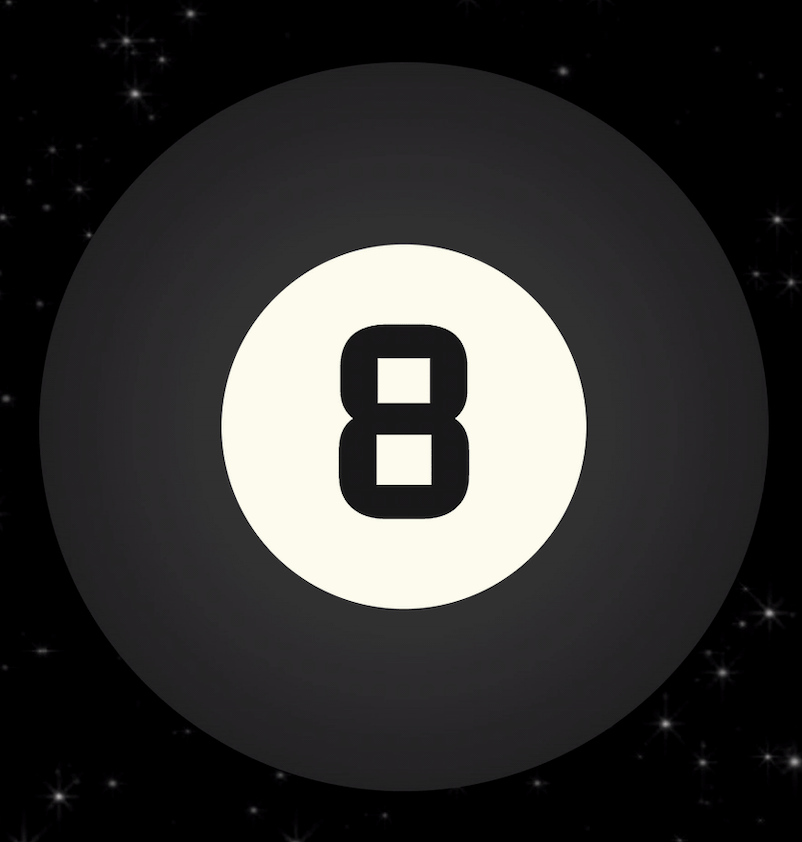
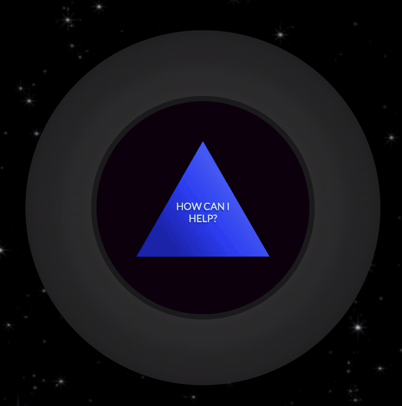
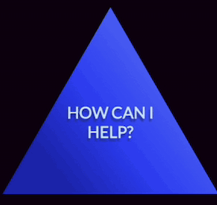

<!-- PROJECT LOGO -->

<h1 align="center">Magic-8-Ball</h1>
  

   This is an online recreation of a Magic 8 Ball. Made in Vanilla JS
     
    <a href="https://magic8ball.johnfarina.co">View Live Demo</a>

<!-- TABLE OF CONTENTS -->

  
Table of Contents

  <ol>
    <li>
      <a href="#about-the-project">About The Project</a>
      <ul>
      <li><a href="#built-with">Built With</a></li>
      </ul>
        <li><a href="#javascript">JavaScript</a></li>
        <ul>
        <li><a href="#fortune-card">Phrases</a></li>
        <li><a href="#creation">Animation</a></li>
        </ul>
      <li><a href="#design">Design</a></li>
      <ul>
      <li><a href="#zoltar">Magic 8 Ball</a></li>
      <ul>
      <li><a href="#zoltar-text">Outer Ball</a></li>
      <li><a href="#lamps">Inner Ball</a></li>
    <li><a>Triangle</a></li>
      </ul>
      </ul>
    </li>
    <li><a href="#usage">Usage</a></li>
    <li><a href="#contact">Contact</a></li>
  </ol>

<!-- ABOUT THE PROJECT -->
## About The Project

For this project I am using Vanilla JS in an attempt to fully master it, This project is of course based off of a Magic 8 Ball a toy people use to ask yes or no questions. It's a simple enough project but designed more to feel like an actual Magic 8 Ball

I'm using JavaScript to add animations and animation logic. With a long array of phrases so it can give random responses for each question.

 

## Built With
 - JavaScript
 - CSS
 

## JavaScript

###  Phrases
All the phrases where stored in array, from a variety of sources I found online. I then find a random number from the length of the saved phrases array and return it into the triangle
### Animation
The animations are triggered when the user presses the button. When first opened it flips the Magic 8-Ball so you can ask a fortune. When facing you the ball shakes and the triangle goes back and comes out with a new yes or no answer. All logic is controlled through JS
 
 

## Design

### Magic 8 Ball
*For all the design I am using HTML and designing it with CSS*
####  **Outer Ball**
For the outer ball I placed a white circle inside another larger black circle with a black 8 inside the smaller circle. Which gives the classic 8-ball look.
 

<!-- image of outside -->

#### **Inner Ball**
For the Inner Ball I created the same smaller circle as the front but made it black trying to resemble like liquid filling inside the 8-Ball
 

#### **Inner Phrase Triangle**
Trying to make the same look of a Magic 8-ball I used a slight gradient on the triangle which is a div that I shaped with CSS. Each Phrase goes into the triangle as the triangle fades in and out.
 

<!-- image of traingle -->

(<a href="#readme-top">back to top</a>)

## Usage

Ask Magic 8 Ball anything. When you don't know what to do let it decide for you.
 
 

<!-- CONTACT -->
## Contact

**John Farina** - johnfarina8@gmail.com

My Website: [johnfarina.co](https://johnfarina.co)

Project Link: [github.com/john-farina/Magic8Ball](https://github.com/john-farina/Magic8Ball)

(<a href="#readme-top">back to top</a>)

